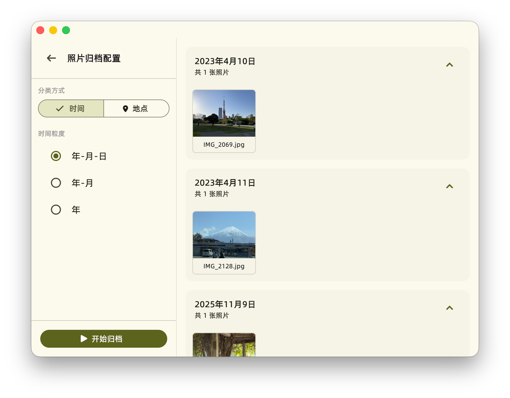
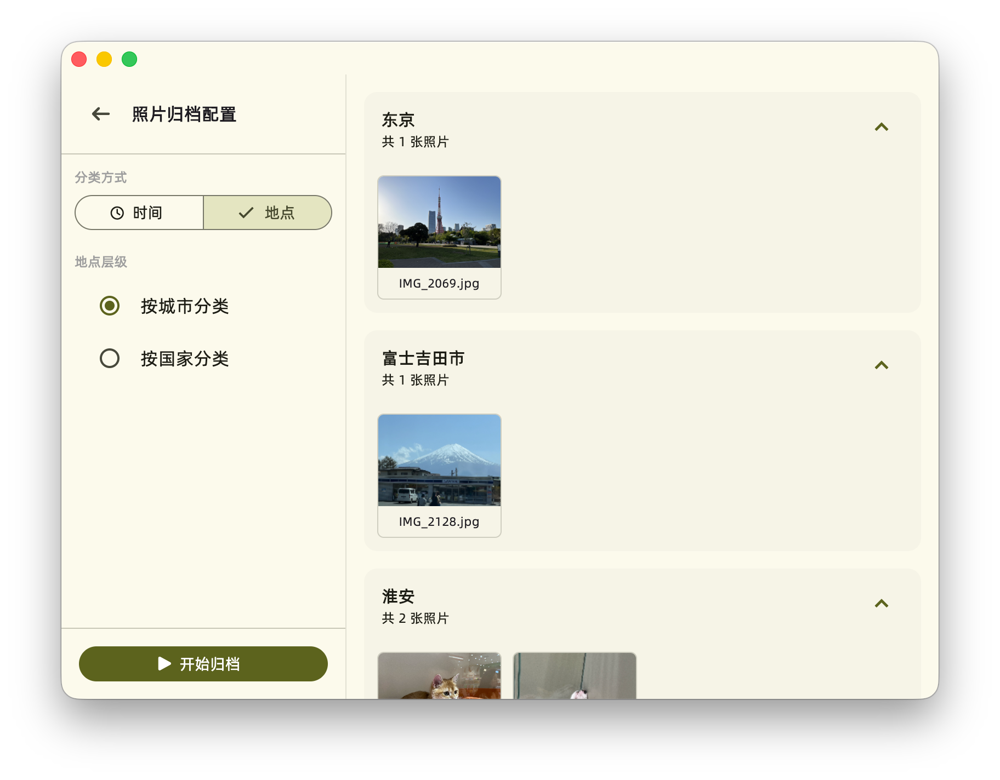

# PhotoArchiver

[English Version](./documents/en.md)

## 简介

PhotoArchiver 是一款能够将文件夹内的照片按照**时间整理**和**地点整理**进行高效分类与归纳的实用工具。

> [!IMPORTANT]
> **使用前提说明：**
> - **EXIF 信息：** 本工具完全依赖照片的 EXIF 元数据。如果照片不包含必要的 EXIF 信息（如时间戳），将会被忽略。
> - **GPS 定位：** 如果您需要使用“按照地点整理”功能，拍摄设备必须支持 GPS 定位功能并已记录经纬度信息（如智能手机拍摄的照片通常包含，而大部分传统相机并不具备 GPS 模块）。

动态库组件仓库[在这里](https://github.com/Zhoucheng133/PhotoArchiver-Core)

## 功能特点

- **按照时间整理**：自动提取照片的 EXIF 拍摄时间，按年、月等层级或时间线将照片归档到对应的文件夹中。
- **按照地点整理**：根据照片内嵌的 GPS 地理位置信息，将照片按国家、省市或具体地点进行智能归类管理。

## 截图

