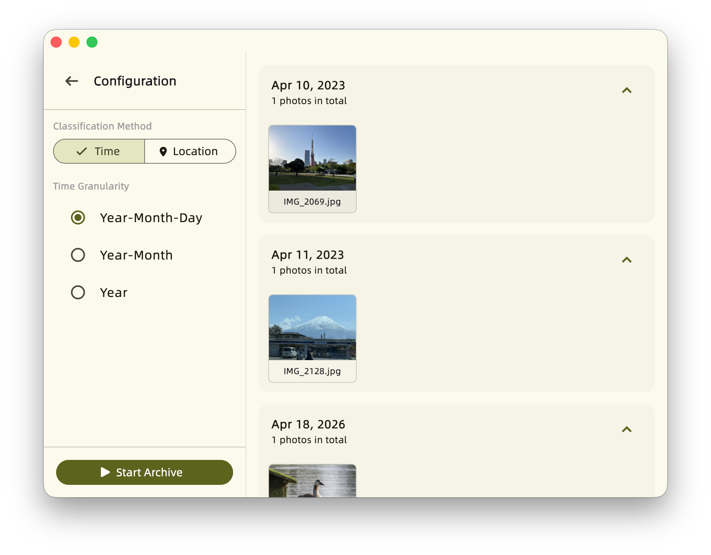
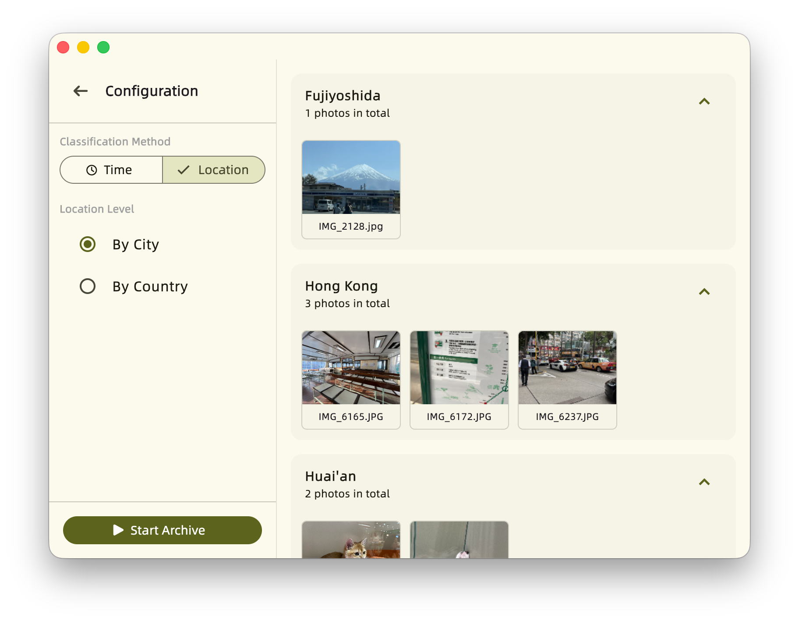

# PhotoArchiver

[中文版本](../README.md)

## Introduction

PhotoArchiver is a utility tool designed to organize and categorize photos within a folder by **Time** and **Location**.

> [!IMPORTANT]
> **Prerequisites:**
> - **EXIF Metadata:** This tool relies entirely on the EXIF metadata of the photos. Photos lacking necessary EXIF information (such as timestamps) will be skipped.
> - **GPS Location:** To use the "Organize by Location" feature, the capture device must support GPS geotagging and record coordinate data (e.g., smartphones usually do, while most traditional standalone cameras do not).
> - **Location Resolution Notes:**
>   - Obtaining photo location information **does not require an internet connection**, provided by [geobed](https://github.com/andreiashu/geobed).
>   - This library does not provide multi-language city name mapping, so Simplified/Traditional Chinese conversion may have issues.
>   - Some location mappings may vary or be imprecise (e.g., some photos can be resolved down to the district/county level, while others only down to the city level).

The repository for the Dynamic Link Library (Core) components can be found [HERE](https://github.com/Zhoucheng133/PhotoArchiver-Core).

## Features

- **Organize by Time**: Automatically extracts EXIF capture timestamps to sort and archive photos into structured folders by year, month, or timeline.
- **Organize by Location**: Intelligent   grouping based on embedded GPS coordinates, organizing photos by country, region, or specific locations.

## Screenshots

