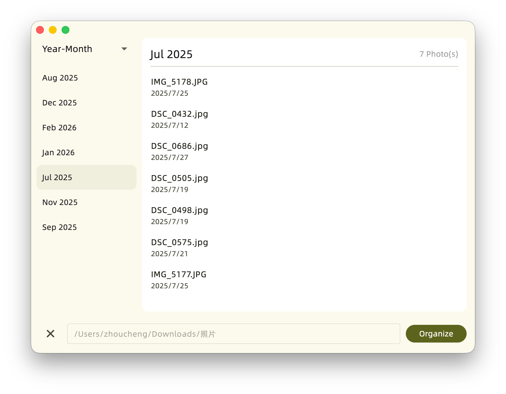

# PhotoArchiver

## Introduction

PhotoArchiver is a utility tool designed to organize multiple photos within a folder into a chronological structure.

> [!IMPORTANT]  
> This tool relies on the **EXIF metadata** of the photos. If a photo does not contain timestamp information, it will be skipped.

The repository for the Dynamic Link Library (Core) components can be found [HERE](https://github.com/Zhoucheng133/PhotoArchiver-Core).

## Screenshots

